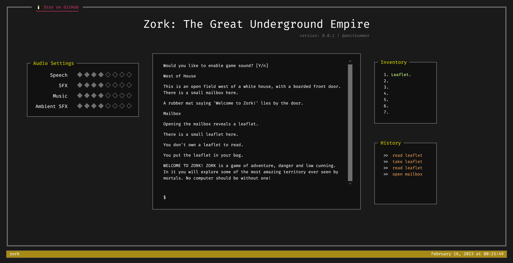

# Zork: The Great Underground Empire



Zork: The Great Underground Empire is a classic text adventure game which was released in 1977.
The player begins as an "adventurer" standing near a white house in a nice forest, but soon descends into the 
Great Underground Empire, where most of the game takes place. The player's quest is to collect the Nineteen
Treasures of Zork.

**Please note: this game is far from being complete. Many items and game
mechanics from the original game are missing.**

## Development

First install the project's dependencies:

```bash
# --legacy-peer-deps is required for installing pinia.
# https://github.com/vuejs/pinia/issues/853
npm ci --legacy-peer-deps
```

Then start the development server:

```bash
npm run dev
```


### Formatting

Formatting is done using `prettier`. To format all source files, use:

```bash
npm run format
```


### Linting

Linting is done with `stylelint`, `eslint` and `prettier`. To perform linting on all source files, use: 

```bash
npm run lint
```

For further information about using `eslint` with `vue3`, check out the [tooling guide](https://vuejs.org/guide/scaling-up/tooling.html#linting) from the `vue3` docs.

Additionally, fixing `stylelint` errors can be done using `stylelint --fix`.


## Deployment

To generate a production-ready build of the application, use:

```bash
ZORK_PRODUCTION=1 npm run build
```

For more information on Nuxt static hosting, check out [nuxt's static hosting guide](https://v3.nuxtjs.org/guide/deploy/static-hosting/).
